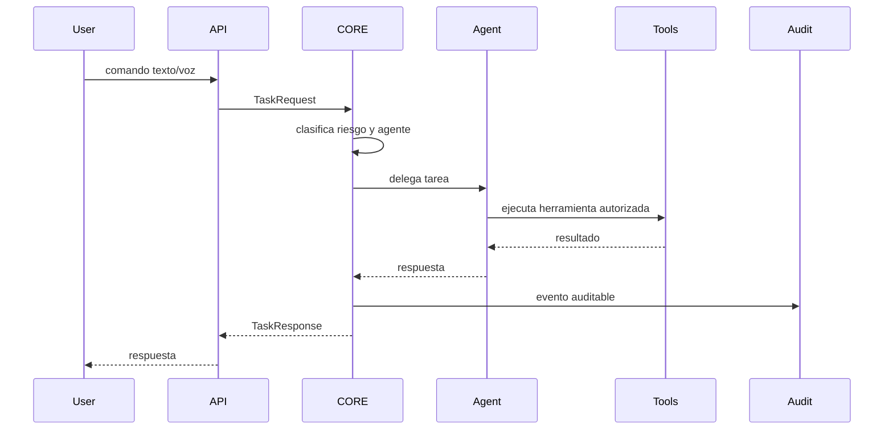

# Sistema multiagente

## Agentes iniciales

| Agente | Responsabilidad | Capacidades |
| --- | --- | --- |
| CORE Orchestrator | Coordina agentes, contexto y politicas | routing, planning, tool coordination |
| Infrastructure Agent | Administra Docker, Kubernetes, logs y deployments | kubectl, helm, docker, monitoreo |
| Cybersecurity Agent | Seguridad defensiva, hardening y analisis de logs | SIEM basico, auditoria, deteccion |
| Research Agent | Investigacion y resumen tecnico | busqueda, citas, sintesis |
| Automation Agent | Workflows, scripts y browser automation | Playwright, Selenium, jobs |
| Memory Agent | Memoria persistente y RAG | embeddings, Qdrant, recuperacion |
| Voice Agent | STT/TTS/wake word | Whisper, Piper, sesiones de voz |
| System Control Agent | Control local del SO | archivos, terminal, procesos, sandbox |

## Flujo de tarea

## Politicas de ejecucion

- Las tareas de solo lectura pueden ejecutarse automaticamente si el usuario esta autenticado.
- Las tareas que modifican archivos, procesos, clusters o credenciales requieren autorizacion o policy allowlist.
- El control del sistema operativo se ejecuta con `ENABLE_SYSTEM_CONTROL=false` por defecto.
- Cada accion debe emitir evento auditable con usuario, agente, herramienta, parametros y resultado.
