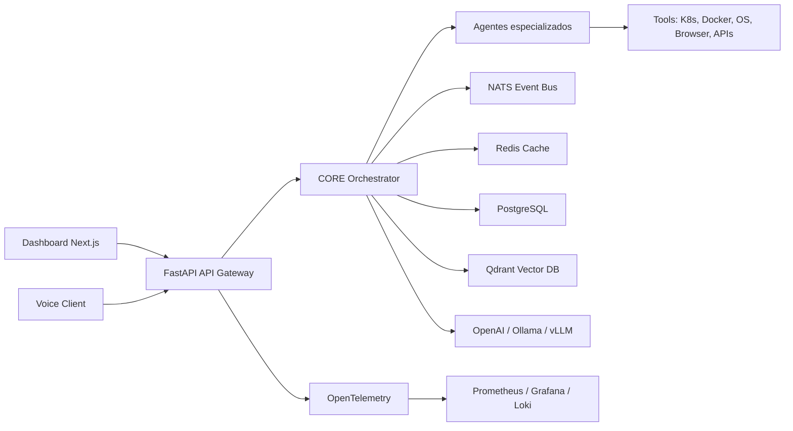

# Arquitectura CEIBO CORE

## Vista general

CEIBO CORE se organiza como una plataforma de microservicios con un API Gateway
FastAPI, agentes especializados, bus de eventos, memoria vectorial y servicios de
datos persistentes.

## Capas

1. Entrada: REST, WebSocket, voz, dashboard y futuras apps moviles.
2. Orquestacion: CORE Orchestrator decide planes, agentes, herramientas y politicas.
3. Agentes: infraestructura, seguridad, investigacion, automatizacion, memoria, voz y control de sistema.
4. Datos: PostgreSQL para entidades, Redis para estado volatil, Qdrant para embeddings.
5. Eventos: NATS para comandos asincronicos, streaming y workflows distribuidos.
6. Observabilidad: Prometheus, Grafana, Loki y OpenTelemetry.
7. Seguridad: JWT/OAuth2, RBAC, auditoria, sandboxing, secret management y rate limits.

## Principios

- Separacion estricta entre intencion, plan, ejecucion y auditoria.
- Directiva maestra: ayudar y ensenar al usuario principal, facilitando sus requerimientos con respuestas claras, utiles y accionables.
- Herramientas peligrosas detras de politicas explicitas y sandbox.
- Agentes sin privilegios globales por defecto.
- APIs versionadas desde el inicio.
- Kubernetes como destino de produccion, Docker Compose como entorno local.
- Preparacion para GPU mediante node selectors, runtime classes y perfiles Helm futuros.
