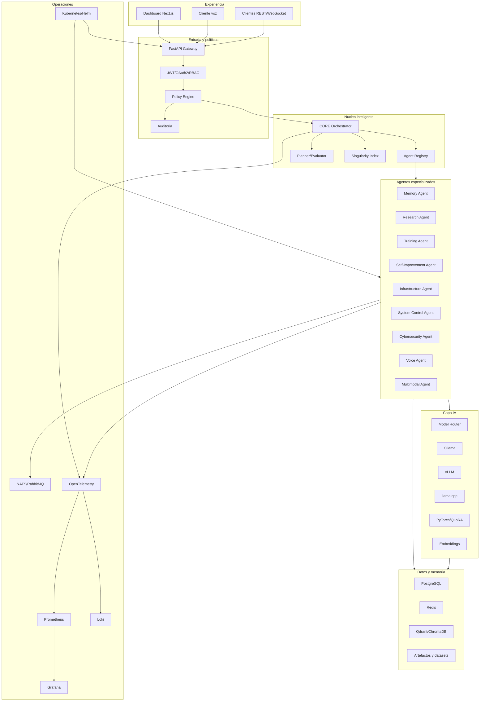
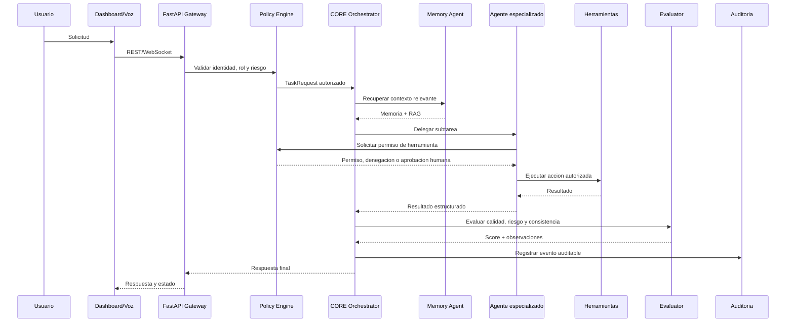
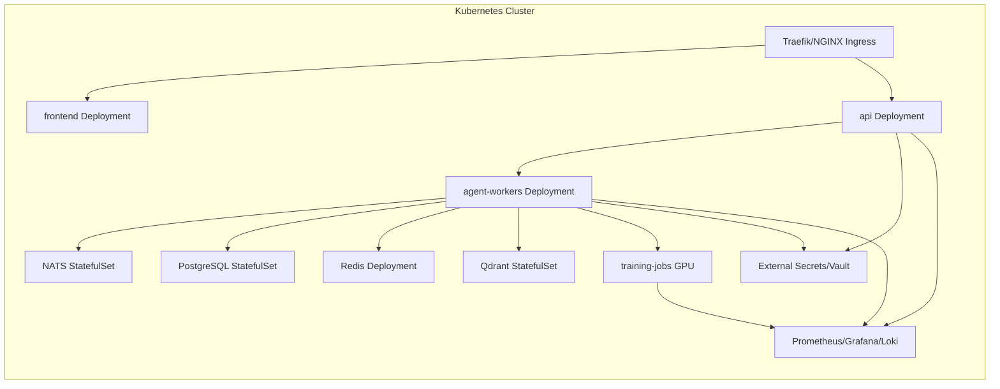
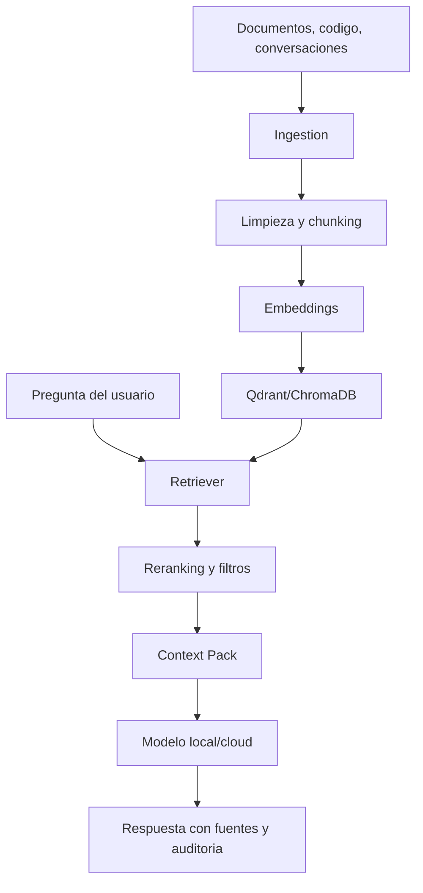
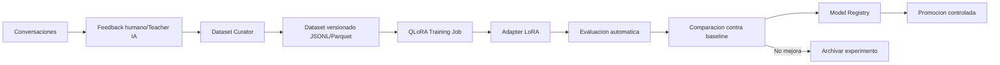
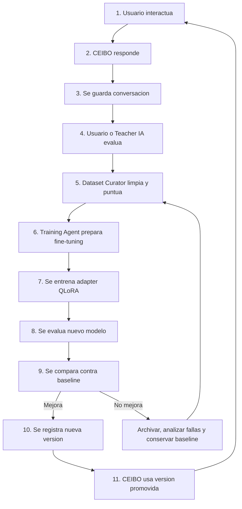

# Ceibo Cognitive Singularity

## 1. Vision del proyecto

CEIBO CORE es una plataforma local-first de inteligencia artificial multiagente, entrenable, modular y observable. Su objetivo no es declarar una Singularidad alcanzada, sino construir una infraestructura tecnica capaz de medir avances progresivos hacia mayor autonomia, memoria, razonamiento, uso de herramientas, aprendizaje continuo y coordinacion de agentes bajo control humano.

La definicion operativa del proyecto es:

> Sistema local multiagente orientado a inteligencia autonoma progresiva.

El horizonte de Singularidad se trata como una direccion de investigacion medible, no como una promesa inmediata. Cada mejora debe poder observarse, evaluarse, versionarse y revertirse.

## 2. Principios de diseno

| Principio | Decision arquitectonica |
| --- | --- |
| Local-first | Inferencia, memoria, datasets y control operativo deben poder ejecutarse en una maquina local o red privada. |
| Modularidad | Cada agente, servicio de IA, base de datos y herramienta se desacopla por API, eventos y contratos versionados. |
| Control humano | Acciones peligrosas requieren aprobacion, politicas RBAC, auditoria y modo humano-en-el-bucle. |
| Medicion real | El progreso se calcula con metricas verificables, benchmarks, evaluaciones humanas y telemetria. |
| Seguridad por defecto | Menor privilegio, sandboxing, secretos gestionados, rate limiting y trazabilidad completa. |
| Escalabilidad gradual | Docker Compose para desarrollo, Kubernetes/Helm para produccion local, on-prem o cloud. |
| Modelos intercambiables | Ollama, vLLM, llama.cpp, modelos cloud y adapters QLoRA deben poder convivir. |
| Aprendizaje controlado | Fine-tuning, RAG y memoria no deben contaminarse sin curacion, evaluacion y rollback. |

## 3. Arquitectura general

CEIBO CORE se organiza en capas: experiencia, API, orquestacion, agentes, IA, datos, eventos, observabilidad, seguridad e infraestructura.



## 4. Componentes principales

| Componente | Responsabilidad | Tecnologia base |
| --- | --- | --- |
| Dashboard | Conversacion, estado operativo, tareas, memoria, metricas, Singularity Index | Next.js, React, TypeScript, TailwindCSS |
| API Gateway | REST, WebSockets, autenticacion, rate limits, entrada de tareas | Python 3.12, FastAPI, Pydantic |
| CORE Orchestrator | Decide agente, contexto, herramientas, riesgo, evaluacion y respuesta final | AsyncIO, agentes internos, eventos |
| Agent Registry | Registro de capacidades, permisos, health y disponibilidad de agentes | Python, PostgreSQL, Redis |
| Model Router | Selecciona proveedor/modelo segun tarea, costo, latencia y privacidad | Ollama, vLLM, llama.cpp, OpenAI-ready |
| Memory Service | Memoria conversacional, episodica, semantica y preferencias | PostgreSQL, Qdrant/ChromaDB, embeddings |
| Training Service | Datasets, curacion, QLoRA, evaluacion, versiones de adapters | PyTorch, CUDA, PEFT, bitsandbytes |
| Event Bus | Workflows asincronicos, streaming, colas y jobs distribuidos | NATS JetStream o RabbitMQ |
| Observability | Metricas, trazas, logs, alertas y auditoria operacional | OpenTelemetry, Prometheus, Grafana, Loki |
| Security Layer | RBAC, aprobaciones, secretos, sandbox, politicas Zero Trust basicas | JWT/OAuth2, Vault/External Secrets |

## 5. Sistema multiagente

| Agente | Objetivo | Entradas | Salidas | Riesgo |
| --- | --- | --- | --- | --- |
| CORE Orchestrator | Coordinar tareas, contexto, agentes y evaluacion | Prompt, estado, politicas, memoria | Plan, delegaciones, respuesta final | Alto |
| Memory Agent | Recordar, recuperar y clasificar conocimiento | Conversaciones, documentos, preferencias | Contexto relevante, memorias nuevas | Medio |
| Research Agent | Investigar y sintetizar fuentes tecnicas | Preguntas, URLs, documentos | Reportes, resumentes, citas | Medio |
| Training Agent | Preparar datasets, fine-tuning y evaluaciones | Feedback, conversaciones, datasets | Adapters, evals, reportes | Alto |
| Self-Improvement Agent | Detectar fallas y proponer mejoras medibles | Logs, feedback, evals | Hipotesis, ejemplos, PRDs tecnicos | Alto |
| Infrastructure Agent | Operar Docker/Kubernetes y servicios | Estado infra, comandos autorizados | Deploys, diagnosticos, rollbacks | Alto |
| System Control Agent | Automatizar archivos, terminal, procesos locales | Tareas del usuario, permisos | Acciones locales auditadas | Muy alto |
| Cybersecurity Agent | Monitoreo defensivo, hardening, auditoria | Logs, politicas, configuraciones | Alertas, recomendaciones, reglas | Alto |
| Voice Agent | STT, TTS, wake word y dialogo natural | Audio | Texto, audio sintetizado, eventos | Medio |
| Multimodal Agent | Vision, OCR, imagen, video, sensores futuros | Imagenes, video, sensores | Analisis visual, eventos roboticos | Medio/Alto |

### Flujo multiagente



## 6. Arquitectura Kubernetes

CEIBO CORE debe desplegarse con Helm y perfiles separados para desarrollo, produccion local, on-prem y cloud. Los workloads de GPU se separan de servicios comunes para escalar inferencia y entrenamiento de forma independiente.



| Area | Recomendacion |
| --- | --- |
| Namespaces | `ceibo-core`, `ceibo-observability`, `ceibo-training`, `ceibo-security` |
| Escalado | HPA para API/frontend, KEDA para workers por cola, nodos GPU para inferencia/training |
| Persistencia | PVC para PostgreSQL, Qdrant, NATS JetStream y artefactos de entrenamiento |
| GPU | Node selectors, tolerations, runtime NVIDIA, perfiles Helm `gpu.enabled=true` |
| Red | NetworkPolicies, Ingress TLS, servicios internos ClusterIP |
| Secretos | External Secrets, Vault, Sealed Secrets o SOPS segun entorno |

## 7. Arquitectura de memoria

La memoria debe separarse en niveles para evitar mezclar datos volatiles con conocimiento persistente.

| Tipo | Uso | Almacenamiento | Retencion |
| --- | --- | --- | --- |
| Memoria corta | Contexto reciente de sesion | Redis/PostgreSQL | Horas/dias |
| Memoria episodica | Conversaciones, decisiones, tareas | PostgreSQL | Larga |
| Memoria semantica | Conocimiento recuperable por embeddings | Qdrant/ChromaDB | Larga |
| Preferencias | Configuracion del usuario y estilo | PostgreSQL | Larga |
| Memoria operacional | Estado de jobs, deployments, agentes | Redis/PostgreSQL | Variable |
| Memoria auditada | Acciones, permisos, cambios criticos | PostgreSQL/Loki | Inmutable o append-only |

El Memory Agent debe aplicar politicas de consentimiento, redaccion de secretos, deduplicacion, score de relevancia y caducidad.

## 8. Arquitectura RAG



| Control | Objetivo |
| --- | --- |
| Chunking semantico | Mantener contexto tecnico coherente |
| Metadata | Fuente, version, usuario, fecha, permiso, sensibilidad |
| Reranking | Priorizar informacion reciente, autorizada y relevante |
| Citacion | Permitir trazabilidad de respuestas tecnicas |
| Guardrails | Evitar usar secretos, datos privados o fuentes no confiables |

## 9. Arquitectura de entrenamiento

CEIBO CORE debe entrenarse por adapters y evaluaciones controladas antes de promover cualquier version.



| Etapa | Requisito minimo |
| --- | --- |
| Curacion | Filtrar PII, secretos, baja calidad, duplicados y respuestas inseguras |
| Versionado | Dataset, config, modelo base, adapter, metricas y fecha |
| Entrenamiento | QLoRA/LoRA como camino principal; full fine-tuning solo con hardware suficiente |
| Evaluacion | Benchmarks tecnicos, tests de regresion, seguridad, latencia y costo |
| Promocion | Solo si supera baseline y no degrada seguridad |
| Rollback | Mantener adapter anterior y ruta de reversion |

## 10. Ciclo de auto-mejora



El Self-Improvement Agent no debe modificarse a si mismo ni desplegar modelos sin control. Su rol es diagnosticar, proponer experimentos, generar ejemplos candidatos y solicitar aprobaciones.

## 11. Singularity Index

El Singularity Index mide progreso tecnico hacia inteligencia autonoma progresiva. Debe mostrarse en el dashboard como porcentaje total y desglose por categoria. Cada categoria combina metricas automaticas, evaluacion humana y estado de infraestructura.

| Categoria | Peso | Senales medibles |
| --- | ---: | --- |
| Razonamiento | 10% | Evaluaciones tecnicas, tareas multi-paso, consistencia, explicabilidad |
| Memoria | 10% | Recall util, precision RAG, persistencia, deduplicacion |
| Autonomia | 10% | Tareas completadas con aprobaciones correctas, menor intervencion manual |
| Uso de herramientas | 10% | Exito de tools, seguridad, trazabilidad, recuperacion ante errores |
| Capacidad multiagente | 10% | Delegacion correcta, latencia, handoffs, conflictos resueltos |
| Entrenamiento propio | 10% | Datasets versionados, adapters generados, mejoras contra baseline |
| Autoevaluacion | 7% | Criticas utiles, deteccion de fallas, evals automatizadas |
| Seguridad | 10% | Cobertura RBAC, auditoria, sandbox, secretos, red-team defensivo |
| Multimodalidad | 5% | STT/TTS, OCR, vision, audio, video |
| Infraestructura | 8% | Docker, Kubernetes, GPU, backups, observabilidad, disponibilidad |
| Capacidad local | 5% | Inferencia offline, modelos locales, privacidad |
| Capacidad distribuida | 3% | Workers, colas, multi-nodo, escalado |
| Aprendizaje continuo | 2% | Ciclos cerrados de feedback-curacion-eval-promocion |

Formula inicial:

```text
Singularity Index = sum(score_categoria * peso_categoria)
```

Cada `score_categoria` debe estar entre 0 y 100. El indice total no afirma conciencia, AGI ni Singularidad; solo resume madurez tecnica del sistema.

## 12. Seguridad y limites eticos

| Riesgo | Control requerido |
| --- | --- |
| Ejecucion no autorizada | RBAC, aprobaciones humanas, sandbox y allowlists |
| Fuga de secretos | Redaccion automatica, vault, scanners, bloqueos en RAG y logs |
| Contaminacion de datasets | Curacion, filtros de PII, evaluacion humana y versionado |
| Auto-mejora insegura | Promocion manual, benchmarks de seguridad, rollback |
| Agentes con exceso de permisos | Menor privilegio, tokens por agente, scopes por herramienta |
| Dependencia de modelos externos | Modo local, fallback, cache y clasificacion de privacidad |
| Alucinaciones tecnicas | RAG con fuentes, evaluacion, tests, citas y verificacion |
| Acciones destructivas | Confirmaciones explicitas, dry-run, backups, auditoria append-only |

Limites eticos:

- No presentar el sistema como consciente, infalible o autonomo sin supervision.
- No permitir acciones ofensivas, exfiltracion, malware o evasion de controles.
- No usar datos personales para entrenamiento sin consentimiento y trazabilidad.
- Mantener logs y memoria con politicas de borrado, exportacion y revision.
- Priorizar interpretabilidad operacional sobre opacidad de decisiones criticas.

## 13. Observabilidad

| Senal | Ejemplos |
| --- | --- |
| Metricas | Latencia por agente, tokens, costo, memoria recuperada, exito de tools, GPU VRAM |
| Logs | Solicitudes, decisiones, permisos, errores, evaluaciones, cambios de modelo |
| Trazas | Flujo usuario -> API -> orquestador -> agente -> herramienta -> respuesta |
| Auditoria | Usuario, agente, accion, parametros, resultado, aprobador, hash del evento |
| Alertas | Fallas de modelo, degradacion de evals, acciones bloqueadas, uso anomalo |

## 14. Requisitos de hardware

| Perfil | CPU/RAM | GPU | Uso recomendado |
| --- | --- | --- | --- |
| Local minimo | 8 cores / 32 GB RAM | Opcional, 8 GB VRAM | Desarrollo, RAG, modelos pequenos |
| Local avanzado | 12-16 cores / 64 GB RAM | 12-24 GB VRAM | Ollama/vLLM, QLoRA pequeno/medio |
| Workstation IA | 24+ cores / 128 GB RAM | 24-48 GB VRAM | Fine-tuning serio, evals paralelas |
| On-prem cluster | Multi-nodo / 256+ GB RAM | GPUs NVIDIA por nodo | Produccion privada, workers, training |
| Cloud hibrido | Segun carga | A10/L4/A100/H100 | Picos de entrenamiento e inferencia |

## 15. Estrategia de despliegue

| Entorno | Objetivo | Forma de despliegue |
| --- | --- | --- |
| Desarrollo local | Iteracion rapida | Docker Compose, SQLite/Postgres local, Ollama opcional |
| Local productivo | Uso personal serio | Docker Compose endurecido o k3s, backups, TLS local |
| On-prem | Privacidad y GPUs propias | Kubernetes, Helm, registry privado, observabilidad completa |
| Cloud | Escalado elastico | Kubernetes gestionado, nodos GPU, object storage, secrets manager |
| Hibrido | Datos sensibles local, compute elastico | RAG/memoria local, training cloud controlado, politicas de datos |

## 16. Expansion a voz, vision y robotica

| Fase | Capacidades |
| --- | --- |
| Voz 1 | Whisper STT, Piper TTS, streaming WebSocket, push-to-talk |
| Voz 2 | Wake word local, diarizacion, perfiles de voz, latencia baja |
| Vision 1 | OCR, analisis de imagenes, ingestion multimodal a RAG |
| Vision 2 | Video, deteccion de eventos, supervision de pantallas/camaras autorizadas |
| Robotica 1 | Integracion ROS2-ready, simulacion, comandos no destructivos |
| Robotica 2 | Sensores, planificacion, actuadores con enclavamientos y aprobacion humana |

## 17. Roadmap por fases

| Fase | Resultado | Entregables |
| --- | --- | --- |
| 0. Base documental | Vision y arquitectura alineadas | Documento maestro, ADRs, backlog tecnico |
| 1. Core local | Chat, API, agentes base, memoria inicial | FastAPI, dashboard, Postgres, Redis, Qdrant, Ollama-ready |
| 2. RAG y memoria | Recuperacion confiable y trazable | Ingestion, embeddings, busqueda, preferencias, auditoria |
| 3. Multiagente operativo | Delegacion real de tareas | Agent Registry, policies, event bus, task queue, tool permissions |
| 4. Entrenamiento controlado | Primer ciclo dataset -> QLoRA -> eval | Dataset curator, Training Agent, model registry, eval harness |
| 5. Seguridad enterprise | Operacion con confianza | OAuth2/RBAC, sandbox, secrets, logs inmutables, rate limits |
| 6. Kubernetes/GPU | Produccion local/on-prem | Helm, HPA/KEDA, nodos GPU, backups, observabilidad completa |
| 7. Voz/multimodal | Interaccion natural y vision inicial | Whisper, Piper, OCR, multimodal RAG |
| 8. Auto-mejora medible | Ciclos cerrados de mejora | Singularity Index, evals continuas, promocion controlada |
| 9. Distribuido avanzado | Escala multi-nodo | Workers distribuidos, colas robustas, federacion de agentes |
| 10. Robotica experimental | Integracion fisica segura | ROS2-ready, simulacion, sensores, safety gates |

## 18. Riesgos tecnicos

| Riesgo | Impacto | Mitigacion |
| --- | --- | --- |
| Hardware insuficiente para modelos grandes | Alto | Modelos cuantizados, adapters, offload, perfiles cloud |
| RAG con baja precision | Alto | Evaluaciones de retrieval, reranking, metadata, limpieza documental |
| Fine-tuning degrada el modelo | Alto | Baselines, evals, rollout gradual, rollback |
| Complejidad multiagente | Alto | Contratos simples, trazas, limites de responsabilidad, tests |
| Seguridad de herramientas locales | Muy alto | Sandboxing, aprobaciones, dry-run, scopes |
| Observabilidad incompleta | Medio | OpenTelemetry desde fase temprana, dashboards y alertas |
| Acoplamiento a proveedor | Medio | Model Router, interfaces abstractas, formatos abiertos |
| Costos cloud/GPU | Medio | Local-first, presupuestos, escalado por demanda |

## 19. Proximos pasos implementables

1. Formalizar `Singularity Index` como modelo de datos y endpoint `GET /api/v1/status/singularity-index`.
2. Agregar tabla `model_versions` y `dataset_versions` en PostgreSQL.
3. Incorporar `AgentCapability` con permisos por herramienta, riesgo y modo `dry_run`.
4. Crear `Evaluation Harness` con pruebas de razonamiento, RAG, seguridad y regresion.
5. Extender el dashboard con panel de agentes, jobs de entrenamiento, memoria y Singularity Index.
6. Definir politicas RBAC iniciales: admin, operator, researcher, viewer.
7. Agregar OpenTelemetry a rutas, agentes y training jobs.
8. Implementar promocion de adapters con estados: `candidate`, `evaluating`, `approved`, `active`, `archived`.
9. Crear flujo de aprobacion humana para System Control Agent e Infrastructure Agent.
10. Preparar perfiles Helm `local`, `onprem`, `gpu` y `cloud`.

## 20. Criterio de exito

CEIBO CORE avanza correctamente si cada fase aumenta capacidades reales sin perder control, seguridad ni trazabilidad. El objetivo no es construir un chatbot mas complejo, sino una plataforma de inteligencia operacional que pueda aprender de forma controlada, recordar con precision, actuar con permisos claros, entrenarse con datos propios y demostrar mejoras medibles ciclo tras ciclo.
